# Содержание
1. [Цель работы](#цель-работы)
2. [Введение](#введение)
	1. [Теоретическая справка](#теор-справка)
	2. [Постановка задачи](#постановка)
3. [Материалы и методы](#мат-и-мет)
	1. [Хеш-функции](#хеш-функции)
	2. [Тесты](#тесты)
		1. [Распределение функций](#распр-функ)
		2. [Ускорение поиска](#ускор-поиска)
4. [Ход работы](#ход-работы)

# Цель работы  <a name="цель-работы"/>

Изучить устройство хеш-таблиц и способы их оптимизации на конкретной задаче поиска слов во множестве.

# Введение <a name="введение" />

## Теоретическая справка <a name="теор-справка" />

***Хеш-таблица*** - это структура данных, позволяющая хранить произвольное множество ключей.

Она позволяет осуществлять следующие операции:
1. Добавить ключ в таблицу
2. Проверить наличие ключа в таблице

***Хеш-функция*** - это функция, с помощью которой производится сопоставление множествам ключей множество натуральных чисел - хешей. По хешу во внутренней структуре хеш-таблицы осуществляется поиск элемента.

К сожалению, хеш-функция не всегда осуществляет однозначное отображение, она может для разных объектов выдать одинаковое число. Такая ситуация называется ***коллизией***.
Хеш-функция должна равномерно распределять множество ключей по таблице. "Равномерно" в данном случае обозначает то, что в таблице не должно быть больших скоплений элементов по одному хешу относительно других.

Для разрешения коллизий существует ***метод цепочек***. Он заключается в том, что в каждой ячейке таблицы мы храним список, в котором перечислены все элементы, имеющие данное значение хеша. Тогда при поиске элемента осуществляется вычисление хеша и поиск в соответствующем списке.

Таким образом, чтобы обеспечить быстрый доступ к элементу, необходимо делать длину списков такой маленькой, насколько это возможно.

Ещё одно важное понятие, к которому мы будем обращаться в работе в дальнейшем, это операция ***рехеширования***. Она происходит путём увеличения размера таблицы и перераспределения по ней уже имеющихся элементов. Эта процедура, в основном, используется для уменьшения длин итоговых списков. 

## Постановка задачи <a name="постановка" />

Работа состоит из двух частей. В **первой части** исследуется набор хеш-функций, а именно то, как они распределяют введенные ключи по таблице. 
Во **второй части** производится оптимизация работы хеш-таблицы на тесте, заключающемся в поиске случайных слов по таблице.

# Материалы и методы <a name="мат-и-мет" />

## Хеш-функции <a name="хеш-функции" />

Для анализа были выбраны следующие хеш-функции:
1. **const** - функция, возвращающая всегда число 1
2. **first_char** - возвращает ASCII-код первого символа строки
3. **strlen** - возвращает длину строки
4. **sum_char** - возвращает сумму ASCII-кодов символов строки
5. **rotr** - функция, устроенная следующим образом:

Пусть `h[0] = 0`. Тогда `h[i] = ROTR(h[i - 1]) XOR str[i - 1]`, где

`ROTR` - функция, осуществляющая циклический побитовый сдвиг вправо. Например, 8-битное беззнаковое число 43, которое имеет в двоичной записи вид 00101011, превращается в 10010101, равное 149
 
 `str` - строка, хеш которой считается
 
 В итоге хеш-функция **hash_rotr** возвращает `h[n]`, где `n` - длина строки

6. **rotl** - функция, аналогичная предыдущей, только с использованием циклического побитового сдвига влево
7. **crc32** - расшифровка: **C**yclic **R**edundancy **C**ode, или циклический избыточный код

Для ознакомления с последней хеш-функцией заинтересованному читателю предлагается прочитать следующие материалы:
- [A painless guide to CRC error detection algorithms](http://www.ross.net/crc/download/crc_v3.txt)
- [Английская википедия](https://en.wikipedia.org/wiki/Computation_of_cyclic_redundancy_checks)

В статье не будет описан принцип работы последней функции, как и не будет поясняться код для её вычисления. Так же будет использоваться тот факт, что инженеры процессоров предусмотрели аппаратную возможность вычисления этой функции

## Тесты <a name="тесты" />

### Распределение функций <a name="распр-функ" />

Для оценки распределения хеш-функций программа запускается на наборе слов из файла [words.txt](assets/data/words.txt). В файле находится 58111 различных слов. Работа хеш-функции оценивается на нескольких размерах таблицы: 751, 2017, 4007, 8009. Это простые числа, они улучшают распределение хеш-функций.  Размеры подобраны таким образом, чтобы отследить поведение функций в различных ситуациях и выделить у них, например, такие свойства, как ограниченность. Полученные размеры списков записываются в dat файлы, по которым строятся гистограммы с помощью gnuplot

### Ускорение поиска <a name="ускор-поиска" />

Используется тот же файл, что и для оценки распределения хеш-функций. Тест заключается в поиске случайных слов из файла. Поиск запускается 20 млн раз. 

*Примечание*: при подготовке к тестированию слова вносятся в хеш-таблицу с учётом операции рехеширования, чтобы использовать оптимальные длины списков (в среднем не более 5 элементов).

Время работы программы замеряется с использованием утилиты perf stat. Профилирование производится с использованием gprof.

# Ход работы <a name="ход-работы" />

1. Была реализована хеш-таблица с использованием cache-friendly списков, написанных отдельным проектом в первом семестре
2. Списки были переписаны с идеей собственного аллокатора, то есть отдельной структуры, которая отвечает за выделение памяти под элементы массива в едином связном куске памяти
3. Хеш-таблица была протестированы с использованием набора функций, представленных выше
4. Длины каждого из списков были записаны в отдельный файл и представлены в виде столбчатых диаграмм
5. Были произведены повторные замеры с увеличенным размером таблицы
6. Была выбрана наиболее оптимальная хеш-функция под задачу
7. На хеш-таблице с выбранной хеш-функцией были произведены тесты по поиску элементов
8. Полученные результаты записаны как результаты ***базовой версии***
9. Произведено профилирование ***базовой версии*** с целью выявления наиболее времязатратных мест программы. 
10. Проведён ряд оптимизацией, подробнее о котором сказано в дальнейшем
11. Все версии программ перетестированы
16. Все результаты тестирования были внесены в общую таблицу для сравнения и определения ускорения, которого мы добились в ходе оптимизаций
17. Получен вывод и идеи по дальнейшей оптимизации хеш-таблиц

# Результаты измерений

## Распределение функций

### *const*

Размер таблицы: 751

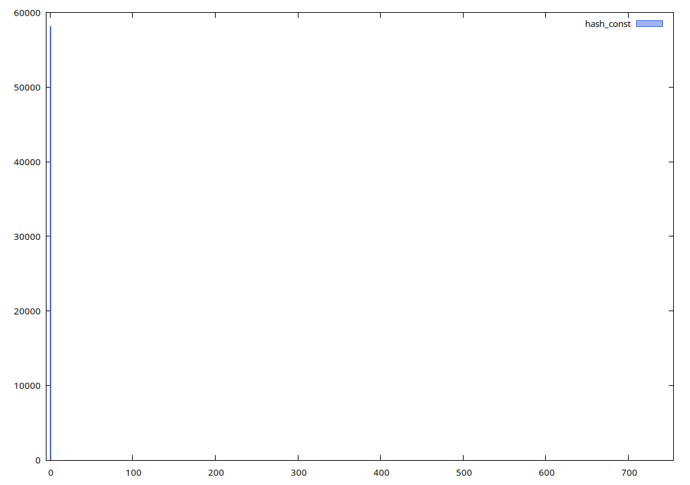

Все слова из нашего файла сконцентрировались в одном списке, что и ожидалось. Рассматривать на других размерах таблицы не требуется. По гистограмме видно, что распределение не подходит для хорошей хеш-функции

### *first_char* 

Размер таблицы: 751

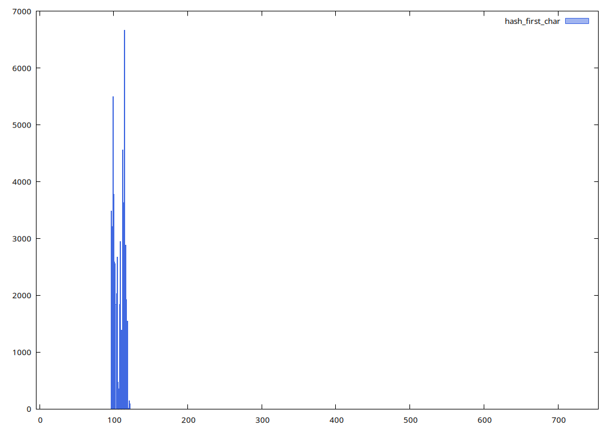

Данная функция является ограниченной. Используются лишь списки с номерами от ASCII-кода буквы 'a' до буквы 'z'

### *strlen* 

Размер таблицы: 751

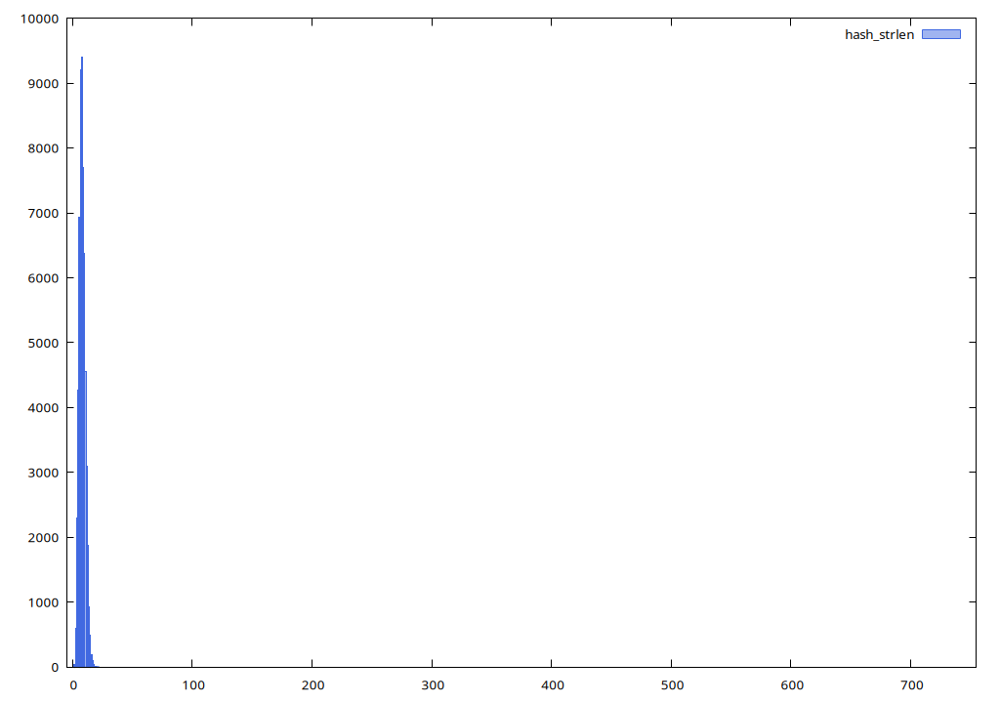

Данная функция является ограниченной. Гистограмма в действительности показывается распределение длин слов в английском языке.

### *sum_char*

Размер таблицы: 751

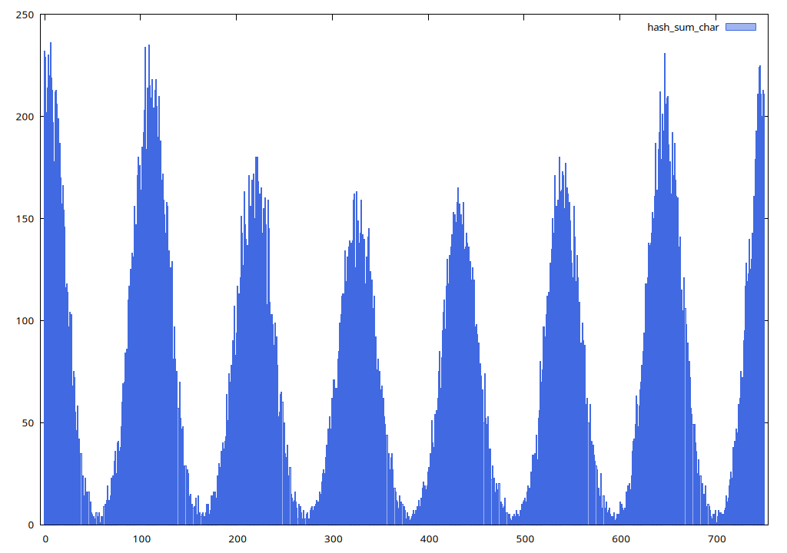

Из данной гистограммы может показаться, что функция не такая и плохая, но предлагаем рассмотреть распределение функции на таблице большего размера.

Размер таблицы: 8009

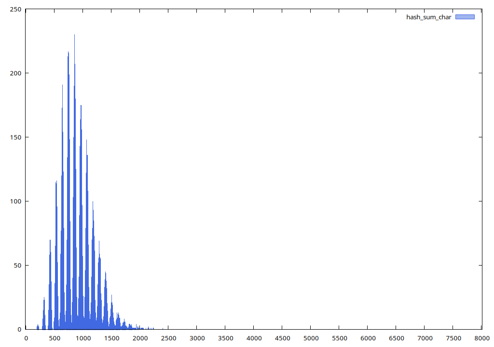

На гистограмме для размера таблицы 8009 отчетливо видно, что данная функция тоже является ограниченной. 
 
### *rotr*

Размер таблицы: 2017

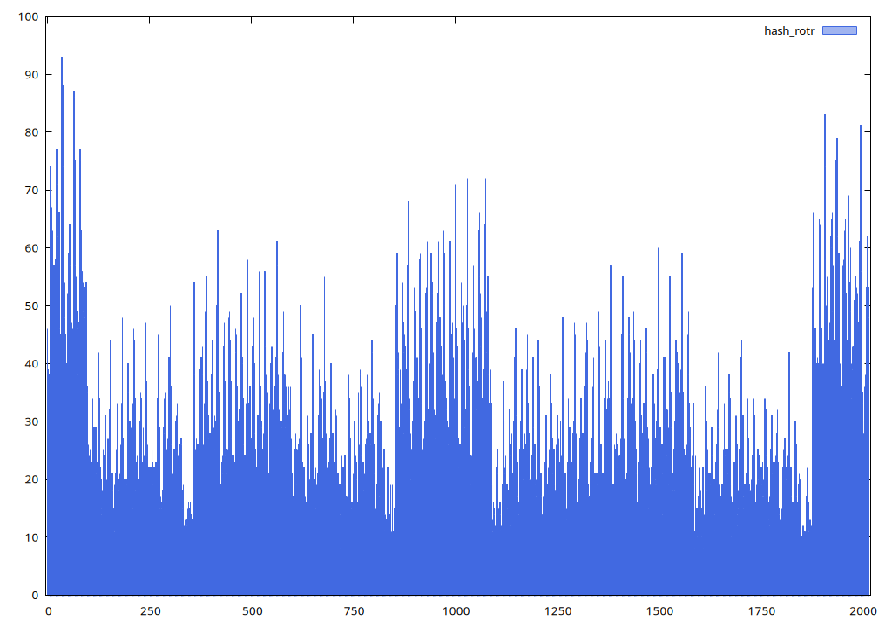

Функция имеет части, в которых скапливается больше всего элементов. Рассмотрим данную особенность на таблице большего размера.

Размер таблицы: 8009

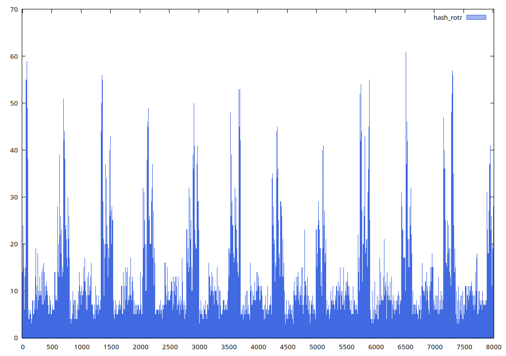

На данной гистограмме отчетливо видно скачки длин списков в таблице.

### *rotl*

Размер таблицы: 2017

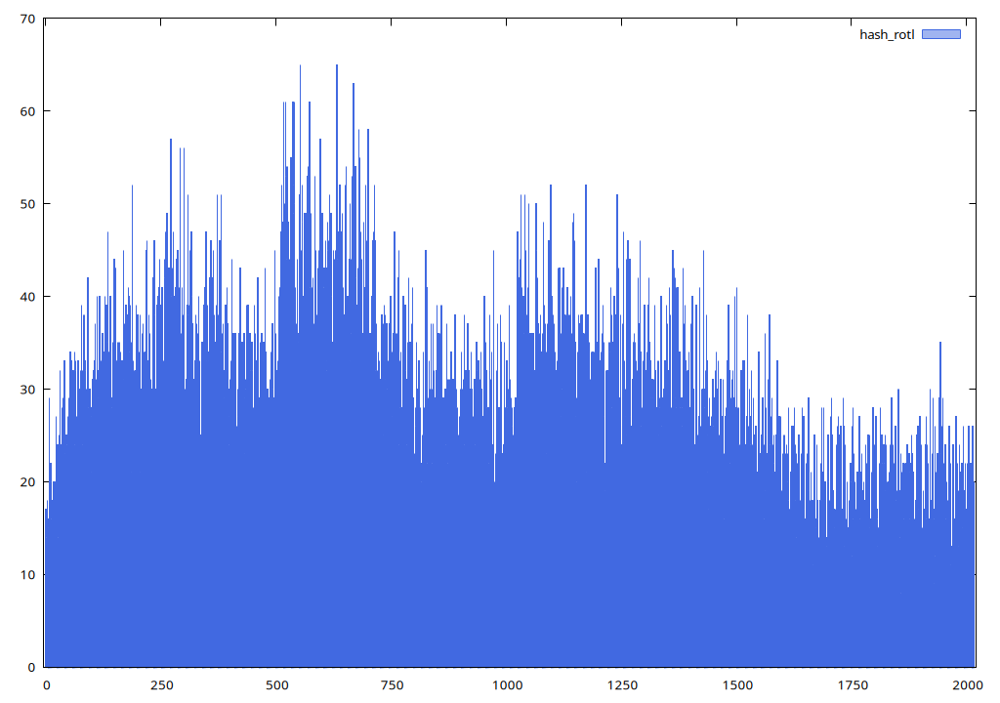

Данная функция имеет распределение лучше, чем у предыдущей, которая отличается от неё лишь направлением сдвига. К сожалению, функция имеет волнообразный характер. Рассмотрим на таблице большего размера.

Размер таблицы: 8009

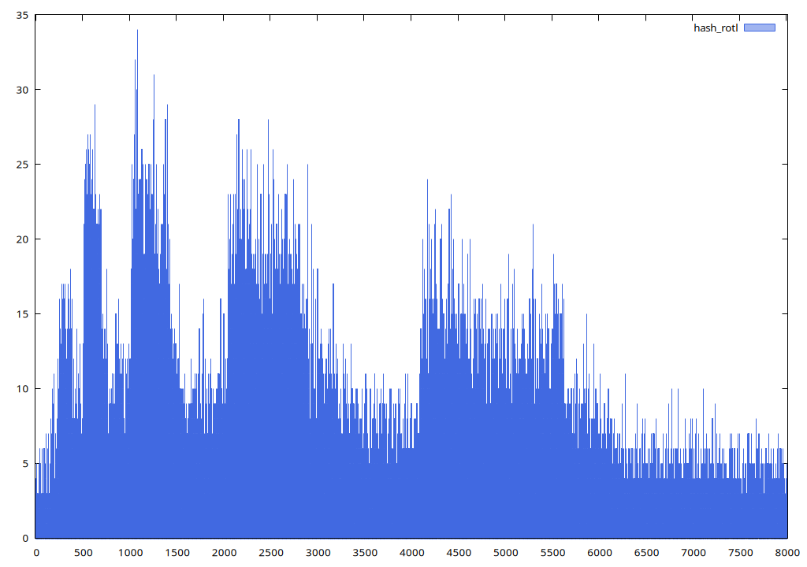

Такая же проблема, как и у предыдущей функции, - есть части, где происходит скопление элементов

### *crc32*

Размер таблицы: 2017

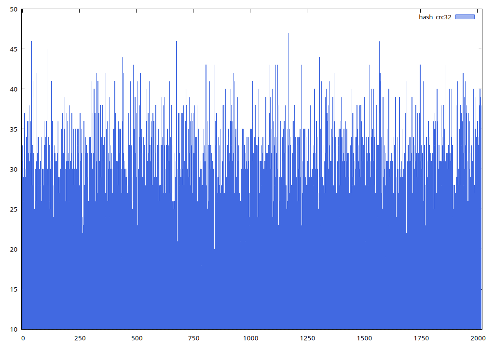

Функция имеет подходящее для нашей задачи распределение. Удостоверимся на таблице большего размера

Размер таблицы: 8009

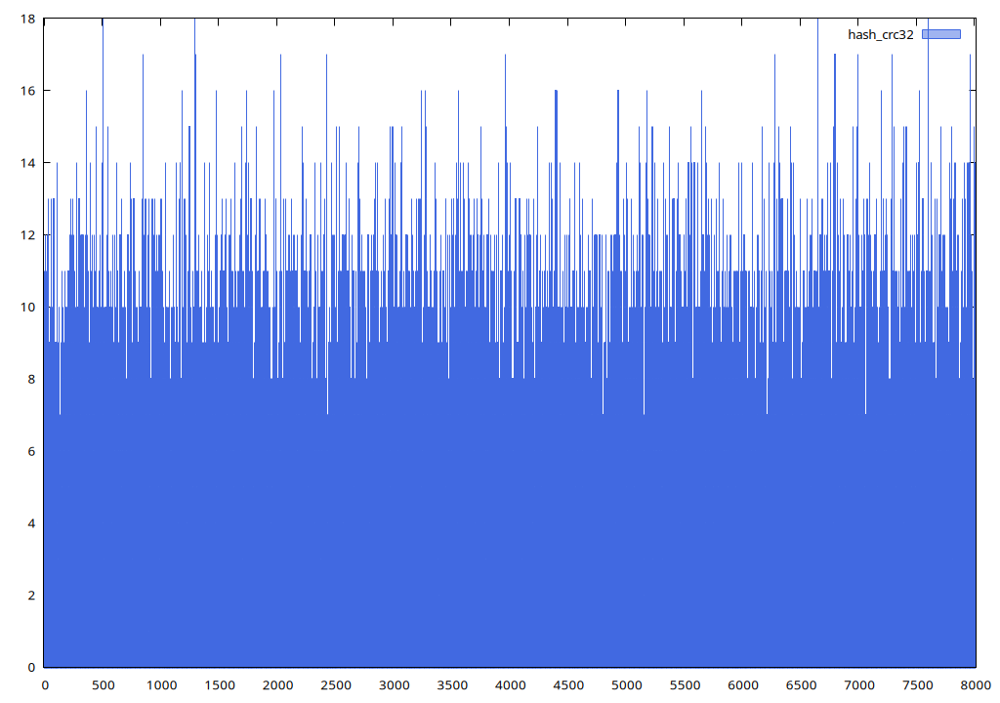

Она не является ограниченной, не имеет областей скопления. Функция действительно подходит нам для дальнейшей работы.

Для численной оценки работы хеш-таблиц приведём таблицу со среднеквадратическими отклонениями длин списков. Данные приведены для размера таблицы 8009, чтобы в оценке были учтены все свойства функций, которые мы заметили ранее.

| const  | first_char | strlen | sum_char | rotr | rotl | crc32 |
|--------|------------|--------|----------|------|------|-------|
| 649.34 | 159.26     | 217.67 | 26.5     | 8.37 | 5.17 | 2.71  |

Исходя из рассмотренных гистограмм, видно, что нельзя руководствоваться только показателем среднеквадратического отклонения. По таблице может показаться, что все последние четыре функции,а именно sum_char, rotr, rotl, crc32, могут нам подойти в силу низкого отклонения, однако ранее мы рассмотрели их и выяснили недостатки. Таким образом, во второй части работы будет использоваться функция crc32.